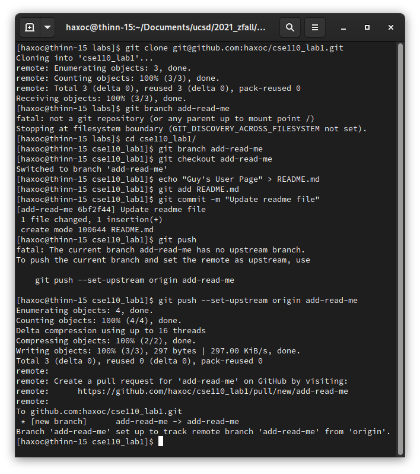

# Guy's User Page

Hanlon's razor:
> Never attribute to malice that which is adequately explained by stupidity

## Contents
1. [Computer](#Computer)
2. [Real](#Real)
3. [Assignment screenshots](#assignment-screenshots)


## Computer
- **College:** [UC San Diego](https://ucsd.edu)
- **Major:** Computer Science
  - classes taken: CSE 100, CSE 101
- **Degree:** Bachelor's
- **GPA:** Good enough<sup>TM</sup>

```
def hello():
    print('hello!')
```

## Real
- [x] Say hello to more people 
- [ ] Complete this lab
- [x] Add pictures to this markdown page

## [Assignment screenshots](assignment-screenshots)

_Git:_


VSCode: [VS Code commit](screenshots/vscode.png)